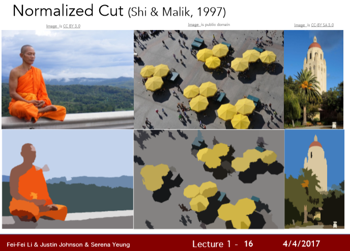
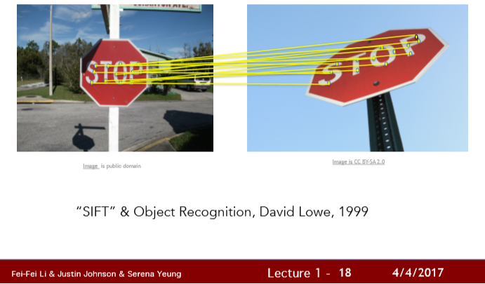
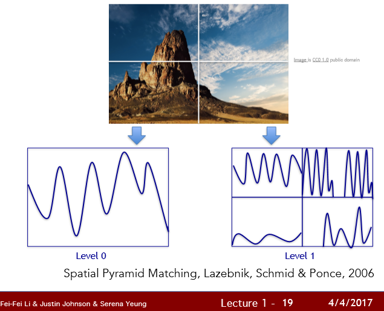
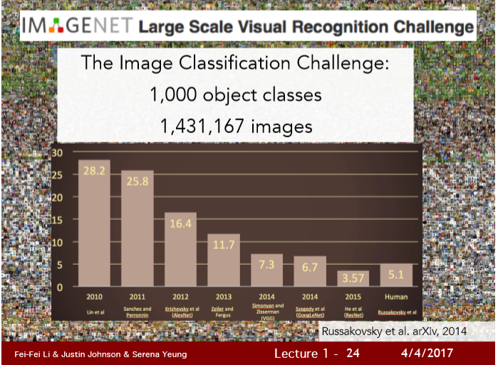
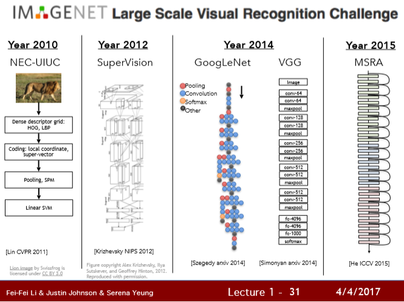

# 1. 비전의 역사

Hubel과 Wiesal의 연구 - "포유류의 시각적 처리 매커니즘은 무엇일까"

> 고양이 뇌 연구 : 시각 처리가 처음에는 단순한 구조로 시작되며 그 정보가 통로를 거치면서 점점 복잡해짐, 실제 세상을 인지할 때 까지

- 객체 인식이 어려움 

- 객체 분할(segmentation)로 해결

  > 이미지의 각 픽셀을 의미 있는 방향으로 군집화하는 방법

  

  

  픽셀로 모아놔도 사람을 정확히 인식할 수 없을지도 모르지만 배경인 픽셀과 사람이 속해있는 픽셀은 가려낼 수 있다.

  ==> 이를 **"영상분할(Image Segmentation)"** 이라고 한다.

- SIFT feature

  > 객체 인식은 객체에서 이와 같은 중요한 특징들을 찾아내고 이 특징들을 다른 객체에 매칭시킴 ==> 이미지 전체를 매칭하는 일보다 쉬워짐

  

  

이미지에서 일부 SIFT 특징들을 추출하여 매칭

- Spatial Pyramid Matching

  > 우리가 특징들을 잘 뽑아낼 수 있다면 그 특징들이 일종의 '단서'를 제공해 줄 수 있다.
  >
  > => 이미지가 풍경 or 고속도로인지

  

  ==> 이미지 내의 여러 부분과 여러 해상도에서 추출한 특징을 하나의 특징 기술자로 표현하고 

  Support Vector Algorithm을 적용한다.

  

============================================================================

2000년대 초 Benchmark Dataset를 모으기 시작했다.

그 중 하나는 PASCAL Visual Object Challenge (VOC) : 20개의 클래스가 있다. ex) 기차,비행기..

그 이후로 두 가지 동기가 있었다.

1. 이 세상의 **모든 것들을 인식**하고 싶다.
2. 기계학습의 **Overfiting**을 해결하자.

그 결과 ImageNet은 대략 15만 장에 달하는 이미지와 22만 가지의 클래스 카테고리를 보유하게 되었다.

==>  ImageNet 덕분에 객체인식이 발전함

==> Image Classification 대회를 함 ==> 2012년도가 가장 오류율이 많이 떨어짐

==> 2012년도에 우승한 알고리즘이 **convolutional neural network** 모델임

==> CNN을 딥러닝이라고도 한다.

그 이후로 CNN을 발전시킨 다음과 같은 모델들이 계속 나왔다.

