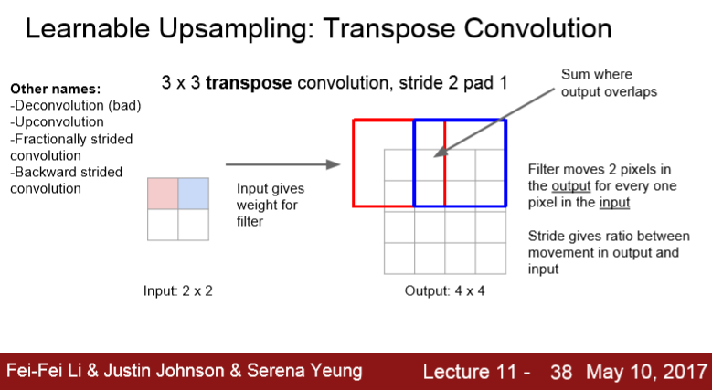

Segmentation, Localization, Detection

------

- 입력 이미지가 들어오면 Deep Conv Net을 통과한다.
- 네트워크를 통과하면 Feature Vector가 나온다. ( AlexNet이나 VGG )
- 최종 Fully Connected Layer는 1000개의 클래스 스코어를 나타낸다.

## 1. Semantic Segmentation

- 입력은 이미지이고 출력으로 이미지의 모든 픽셀에 카테고리를 정한다.

- 출력은 모든 픽셀에 대해서 그 픽셀이 고양이, 잔디, 하늘, 나무, 배경 인지를 결정하는 것이다.

- classification과 다른 점은 이미지 전체에 카테고리 하나가 아니라 모든 픽셀에 카테고리가 매겨진다.

- semantic segmentation은 개별 객체를 구분하지 않는다. 

  아래 사진처럼 Cow 두 마리를 구분하지 않고, 픽셀의 카테고리만 구분한다.

  ==> 이 단점은 뒤에 나올 "Instance Segmentation"이 해결해 준다.

  

우선 semantic segmentation문제에 접근해 볼 수 있는 방법 중 하나는 classification을 통한 접근이다.

## 1-1. Sliding Window

- 입력 이미지를 아주 작은 단위로 쪼갠다.

- 이 작은 영역만을 가지고 classification문제를 풀어본다.

- 해당 영역이 어떤 카테고리에 속하는지를 정해본다.   

  

  ==> 이처럼 모든 픽셀에 대해서 작은 영역으로 쪼개고, 이 모든 영역을 forward/backward pass하는 일은 비효율적이다.

  ==> 개선한 방법이 다음 내용인  Fully Convolutional Network 방법이다.

## 1-2.  Fully Convolutional

- FC-Layer가 없고 Convolution Layer로 구성된 네트워크

- 출력 Tensor는 C x H x W ( C는 카테고리 수 )

- 출력 Tensor는 입력 이미지의 모든 픽셀 값에 대해 Classification Scores를 매긴 값이다.

- 이 네트워크를 학습시키려면 우선 모든 픽셀의 Classification loss를 계산하고 평균 값을 취하고,

  기존처럼 back propagation을 수행하면 된다.

- training data는 입력 이미지의 모든 픽셀에 대해서 레이블링 해야한다.

- Loss function을 구하는 방법

  - 이 문제는 모든 픽셀을 classification하는 거니까 출력의 모들 픽셀에 Cross entropy를 적용한다.
  - 이 값들을 모두 더하거나 평균화시켜서 Loss를 계산한다. 
  - 또는 Mini-batch 단위로 계산할 수도 있다.

- 이 네트워크의 문제점

  - 입력 이미지의 Spatial Size를 계속 유지시켜야 하기 때문에 비용이 크다.

  ==> 대신에 Feature Map을 Downsampling/Upsampling한다.

  

### **[Upsampling 하는 방법]**

### 1) **unpooling**

- nearest neighbor unpooling

   : 해당하는 receptive field로 값을 그냥 복사

- bed of nails unpooling

   : unpooling region에만 값을 복사하고, 다른 곳에는 모두 0을 채워넣는다.

### 2) **Max Unpooling**

각 unpooling과 pooling을 연관짓는 방법

### 3) **Transpose Convolution**

- 앞에 두 방법은 "고정된 함수"이고 별도로 학습을 시키지는 않는다.

- 계산 방식은 기존과 유사하다. 3x3 가 있고 이미지의 좌상단 구석에서부터 내적을 계산한다.

- 하지만 Strided convolution은 한 픽셀씩 이동하면서 계산하지 않는다.

- 여기서는 내적을 수행하지 않는다. 우선 입력 특징맵에서 값을 하나 선택한다.(빨간색)

- 아래 그림처럼 좌상단에서 뽑은 하나의 값이 스칼라 값일 때, 이 스칼라 값을 필터와 곱한다.

- 그리고 출력의 3x3 영역에 그 값을 넣는다.

  ==> Transpose Convolution에서는 필터와 입력의 내적을 계산하는 것이 아니라 입력 값이 필터에 곱해지는 가중치의 역할을 한다. 출력값은 필터 x 입력(가중치)이다.

- Upsampling 시에는 입력에서 한칸씩 움직이는 동안 출력에서는 두 칸씩 움직인다.
- 겹치는 경우에는 두 값을 더해준다.

**Transpose Convolution**의 구체적인 예시를 위해 다음과 같은 1D Example을 보자.

- 1차원에서 3x1 Transpose Convolution을 수행한 것이다.

## 2. Classification + Localization

- 출력 레이어 직전의 FC-Layer는 "Class score"로 연결되어서 카테고리를 결정한다.

- FC-Layer가 하나 더 있다. 이는 4개의 원소를 가진 vector와 연결되어 있다.

- 이 4개의 출력 값은 width , height , x , y로 bounding box의 위치를 나타낸다.

- 이런식으로 네트워크는 2가지 출력값을 반환하는데,

  하나는 **Class Score**이고, 

  다른 하나는 입력 영상 내의 객체 위치의 **bounding box의 좌표**이다.

- 학습시킬 때 loss가 2개 존재한다.

  (학습 이미지에는 카테고리 레이블과 해당 객체의 bounding box GT를 동시에 가지고 있어야한다.)

  - Softmax loss

    : class scores를 예측하기 위함

  - L2 loss

    : Ground Truth Bbox와 예측한 Bbox 사이의 차이를 측정하는 loss

    (두 Bbox 좌표 간의 차이에 대한 regression loss)

    ** regression loss : cross entropy나 softmax가 아닌 losses를 의미한다.

    ​                                   (L2, L1, smooth L1 loss 등이 있다.)

  ==> 이 두 losses의 가중치 합이 최종 loss이다. 

  ==> 그리고 이 두 Losses의 가중 합에 대한 gradient를 계산하는 것이다.

  

Bbox와 같이 이미지 내의 어떤 위치를 예측한다는 아이디어는 다음과 같은 human pose estimation에도 적용이 가능하다.

- 입력 : 사람 이미지

- 출력 : 사람의 각 관절 위치 (14개의 좌표)

- 네트워크 : 사람의 포즈 예측 (팔,다리가 어디에 있는지)

- 예측된 14개의 점(연속적인 값)에 대해서 regression loss를 계산하고 backprop으로 학습시킨다.

  ==> (continuous value)  L2, L1, smooth L1 loss 와 같은 regression loss를 사용한다.

  ==> (categorical value) 고정된 개수의 카테고리가 있고 모델이 이를 결정하기 위한 class score를 출력하는 경우라면 cross entropy / softmax / SVM margin Loss를 사용한다.

## 3. Object Detection

- 입력 이미지가 주어지면 이미지에 나타나는 객체들의 Bbox와 해당하는 카테고리를 예측한다.

- 첫번째 이미지는 4개의 숫자만 예측하면 된다.

- 두번째 이미지는 좌표 4개씩 객체가 3개니까 12개의 값을 예측해야 한다.

- 마지막 이미지는 오리 한 마리당 값이 4개씩 엄청 많은 값을 예측해야 한다.

  ==> Object Detection 문제로 Regression 문제를 푸는 것은 어렵다.

## 3-1. Sliding Window

- 입력 이미지로부터 다양한 영역을 나눠서 처리한다.

- 가령 이미지의 왼쪽 밑에서 작은 영역을 추출해서 그 작은 영역만 CNN의 입력으로 넣어준다.

- CNN은 이 작은 영역에 대해서 Classification을 수행한다.

  ==> CNN은 이 부분에는 개도,고양이도 없다고 판단하고, 배경(background) 카테고리를 추가한다.

  ==> 네트워크가 배경이라고 예측했다면 이 곳은 어떤 카테고리에도 속하지 않는다는 것을 의미한다.

  

==> 하지만 이 방법에는 어떻게 영역을 추출할지가 문제가 된다. ( 이미지에 Objects가 몇 개가 존재할지, 어디에 존재할지를 알 수가 없다.)

==> 작은 영역 하나 하나마다 CNN을 통과시키면 계산량이 너무 많아진다.

===> 따라서 Sliding Window방법 안 쓰고 다음과 같은 방법 쓴다.

## 3-2. Region Proposals 

- 딥러닝이 아닌 전통적인 신호처리 기법 사용

- Region Proposal Network는 Object가 있을법한 가령, 1000개의 Bbox를 제공해 준다.

  (객체가 있을지도 모르는 후보 영역들)

- Region Proposal을 만들어낼 수 있는 방법에는 Selective Search가 있다.

- CPU로 2초간 Selective Search를 돌리면 2000개의 Region Proposal를 만들어 낸다.

  ==> 노이즈가 심함

  

이런 아이디어는 다음과 같이 R-CNN 논문에 나온다.

------

## 3-3. R-CNN

- 이미지가 주어지면 Region Proposal을 얻기 위해 Region Proposal Network를 수행한다.

  ( Region Proposal = Region of Interest ( ROI ) )

  Selective Search를 통해 2000개의 ROI를 얻어낸다. (다 크기가 다름)

- CNN의 입력으로 사용하기 위해서 ROI를 동일한 고정된 크기로 변형시켜야 한다.
- 그리고 각각의 Region Proposal을 CNN에 통과시킨다.
- RCNN의 경우에는 ROI들의 최종 Classification에 SVM을 사용했다.
- Region Proposal을 보정하기 위한 regression 과정도 거친다.

==> Region Proposal마다 CNN을 수행해야 하므로 수천 번의 forward passes가 요구된다. ==> 아주 느림

==> Fast R-CNN이 해결

## 3-4. Fast R-CNN

- 각 ROI마다 각각 CNN을 수행하지 않고 전체 이미지에 CNN을 수행한다.

  ==> 그 결과 전체 이미지에 대한 고해상도 Feature Map을 얻을 수 있다.

- R-CNN에서처럼 Selective Search로 Region Proposal를 계산한다.

- CNN Feature map에 ROI를 Projection 시키고 전체 이미지가 아닌 Feature map에서 뜯어온다.

- 그 다음에는 FC-layer가 있는데 FC-layer는 고정된 크기의 입력을 받는다.

- 따라서 CNN Feature map에서 뜯어온 ROI는 FC-layer의 입력에 알맞게 크기를 조정해 줘야 한다.

  ==> 이 방법이 ROI Pooling layer이다.

- 그리고 FC-layer의 입력으로 넣어서 classification score와 linear regression offset을 계산할 수 있다.

- Fast R-CNN을 학습할 때는 두 loss를 합쳐서 Multi-task Loss로 Backprop을 진행한다.
- 이 방법을 통해 전체 네트워크를 합쳐서 동시에 학습시킬 수 있다.

## 3-5. Faster R-CNN

- Faster R-CNN은 네트워크가 region proposal을 직접 만들 수 있다.
- 입력 이미지 전체가 네트워크로 들어가서 Feature map을 만든다.
- Faster R-CNN은 별도의 region proposal network가 있다.
- RPN은 네트워크가 Feature Map을 가지고 region proposals을 계산하도록 한다.
- RPN을 거쳐 region proposals을 예측하고 나면 나머지 동작은 fast R-CNN과 동일하다.
- 그리고 multi-task loss를 이용해서 여러가지 losses를 한번에 계산한다.

## 3-6.  YOLO / SSD

- feed forward를 오로지 한 방향으로 수행하는 네트워크

- 각 task를 따로 계산하지 말고 하나의 regression문제로 푸는 것이다.

- 입력 이미지가 있으면 이미지를 큼직하게 (ex 7x7 grid)로 나눈다.

- 각 Grid Cell내부에는 Base BBox가 존재한다.

- 다음과 같은 경우에는 Base BBox가 세 가지 있다. 길쭉한 거, 넓은 거, 정사각형 (실제로는 3개 이상 사용)

- 이 각각의 grid cell에 대해 BBoxes가 있고 이를 기반으로 예측을 수행한다.

- 각 BBoxes에 대해서 classification scores를 계산해야 한다.(BBoxes안에 이 카테고리에 속한 객체가 존재할 가능성)

- 네트워크에 입력 이미지가 들어오면 7x7 Grid마다 (5B + C)개의 tensor를 가진다.

  (C : C개의 카테고리에 대한 Classification score 

- 즉, 입력은 이미지이고, 출력은 3-dim tensor

- Faster R-CNN은 RPN으로 먼저 Regression문제를 풀고 ROI단위로 Classification을 하는 방식이라면 

  여기서는 single shot methods로 단 한번에 forward pass만으로 끝내버리는 방식이다.

- 

## 4. Instance Segmentation

### Mask R-CNN

- 입력 이미지가 주어지면 객체 별로 객체의 위치를 알아내고, 객체 별 Segmentation Mask를 예측해야 한다.

- 이미지에서 각 객체에 해당하는 픽셀을 예측해야 하는 문제이다.

  ==> Segmentation  + Object Detection 문제

  

- 처음 입력 이미지가 CNN과 RPN을 거친다. 여기까지는 Faster R-CNN과 유사하다.
- 그리고 Fast/Faster R-CNN에서 했던 것처럼 feature map에서 RPN의 ROI만큼을 뜯어낸다.
- 다음 단계는 Faster R-CNN에서 처럼 Classification/BBox Regression을 하는 것이 아니라 각 BBox마다 Segmentation  mask를 예측한다.
- RPN으로 뽑은 ROI 영역 내에서 각각 semantic segmentation 을 수행한다.
- 

==> Mask R-CNN으로 Pose estimation도 수행할 수 있다. 

​		( 각 Region proposals 갈래 하나를 추가해서 현재 Region proposal 안의 객체의 관절에 해당하는 좌표를 예측하도록 하면 된다. ==> loss와 layer를 하나 더 추가)

다음과 같은 결과를 볼 수 있다.

- feed forward 한 번으로 
  - 이미지 내에 사람이 몇명 있는지, 
  - 어디에 있느지, 
  - 어떤 픽셀에 해당하는지를 알아낼 수 있고, 
  - 사람들의 Skeleton Estimation도 가능하다.
  - Faster R-CNN 프레임워크 기반이기 때문에 실시간에 가깝게 처리할 수 있다.