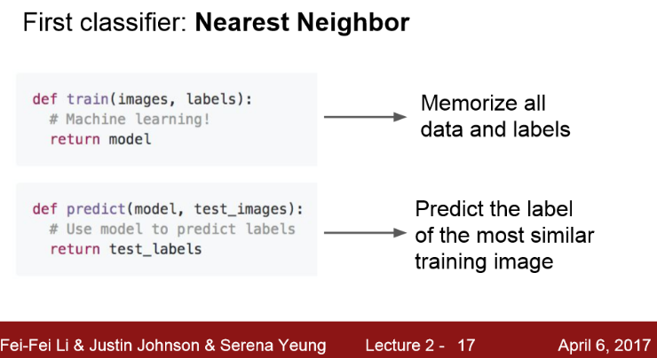

# [KNN]

## 1. Nearest neighbor Classifier

## 2. L1 Distance

테스트 이미지 하나를 모든 학습 이미지들과 비교할 때 여러가지 비교 방법들(어떤 비교 함수를 사용할지)이 있다. 그 중하나는 L1 Distance (=Manhattan distance)

- L1 Distance

  > - 이미지를 Pixel-wise로 비교
  >
  > - 테스트/트레이닝 이미지의 같은 자리의 픽셀을 서로 빼고 절댓값을 취해서 모두 더함

==> 두이미지는 456만큼 차이가 난다.

코드로 보면 다음과 같다.

Q) trainset의 이미지가 총 N개라면 train/test 함수의 속도는 어떻게 될까?

A1) train time : 상수시간 O(1) 

> - 데이터를 기억만 하면 된다.
> - 포인터만 잘 사용해서 복사하면, 데이터 크기와 상관없이 상수시간으로 끝낼 수 있다.

A2) test time

> - N개의 학습 데이터 전부를 테스트 이미지와 비교해야하만 한다. ==> 느림
> - train time < test time  => 잘못됨! test time 이 더 빨라야 한다.

===> 이런 관점에서 NN 알고리즘은 정 반대의 경우이다.  

​          (CNN 같은 parametic model들은 NN과 정반대)

## 3. NN의 "decision regions"

> - noise 같은 것들이 끼어있다.

이런 문제때문에 NN의 일반화 된 버전인 k-NN 알고리즘이 탄생하였다.

## 4. KNN 

> - DIstance metric을 이용해서 가까운 이웃을 k개 만큼 찾고 이웃끼리 투표하는 방법
> - 가장 많은  표를 받은 레이블로 예측

==> k가 클 수록 결정경계가 더 부드러워지고 분류가 잘 되는 것을 볼 수 있다.

## 5. L1 distance, L2 distance

이웃간의 거리를 측정하는 방법은 L1 distance, L2 distance 이렇게 있다.

-  **L1 distance**

  - 사각형 위의 점들이 모두 원점으로부터 동일한 거리만큼 떨어져 있다.

  - 어떤 좌표 시스템이냐에 따라 많은 영향 받음

    ex) 기존의 좌표계를 회전시키면 L1 distance가 변함

  - 만약 특징 벡터의 각각 요소들이 개별적인 의미를 가지고 있다면(ex. 키, 몸무게) L1 distance

-  **L2 distance**

  - 좌표계와 아무 연관이 없음
  - 만약 특징 벡터가 일반적인 벡터이고, 요소들간의 실질적인 의미를 잘 모르는 경우라면 L2 distance

> -  L1 distance는 결정 경계가 "좌표 축"에 영향을 받는 경향이 있음

## 6. Setting Hyperparameters

1) 다양한 하이퍼파라미터로 training set 학습

2) validation set으로 검증하고, validation set에서 가장 좋았던 하이퍼파라미터를 선택

3) validation set에서 가장 좋았던 분류기를 가지고 test set 에서는 "오로지 한번만" 수행

또 다른 하이퍼파라미터 선택 전략은 Cross-Validation이다.

**Cross-Validation**

- 작은 데이터셋일 경우 많이 사용하고 딥러닝에서는 많이 사용하지 않는다.
- 우선 test set을 정해놓고, 나머지는 train/validation set으로 나누고 train set 을 여러 부분으로 나눈다.
- 이런 식으로 번갈아 가면서 validation set을 지정해준다.
- 위 예제는 5-fold Cross-Validation이다.
  - 처음 4개의 fold에서 하이퍼 파라미터를 학습시키고, 남은 한 fold에서 알고리즘을 평가한다.
  - 그리고 1,2,3,5 fold에서 다시 학습시키고 4 fold로 평가한다. 이런식으로 계속 순환
  - 이런 방식으로 최적의 하이퍼파라미터를 확인할 수 있다.
- 실제로 딥러닝같은 큰 모델은 학습 자체가 계산량이 많기 때문에 잘 안 쓰인다.

[Cross-Validation을 적용한 모델에 대한 그래프]

> - x축 : K-NN의 K
> - y축 : 분류 정확도
> - 5-fold Cross-Validation
>   - 각 k마다 5번의 Cross-Validation을 통해 알고리즘이 얼마나 잘 동작하는지 알려줌
> - 하이퍼 파라미터에 따라 모델의 정확도와 성능으 평가할 수 있고, validation set의 성능이 최대인 하이퍼 파라미터를 선택하게 될 것이다. ==> 여기서는 k = 7

실제로 knn은 분류 문제에 잘 쓰이지 않는다.

- 이유1) 느려서

- 이유2) L1,L2 Distance가 이미지 간의 거리를 측정하기에 적절하지 않음

- 

  > - 첫번째 사진과 오른쪽 변형한 3개의 사진과의 L2 Distance가 같음 

- 이유3) 차원의 저주

# [Linear Classification]

## 1. Linear Classifier

Linear classifier는

> - "parametric model"의 가장 단순한 형태
>
> - x : 입력 이미지
>
> - w : 가중치 (=세타)
>
> - 함수 f(x,W)는 data x와 parameter W를 가지고 10개의 숫자를 출력한다.
>
>   이 숫자는 CIFAR-10의 각 10개의 카테고리 score
>
>   (고양이의 score가 높으면 고양이로 예측한다는 것)

==> 어떤 식으로 가중치 W와 데이터를 조합할지를 고려해 볼 수 있는데, 이 과정들이 모두 다양한 NN아키텍쳐를 설계하는 과정이다.

==> 가중치 W와 데이터 X를 조합하는 가장 쉬운 방법은 이 둘을 곱하는 것이다.

==> 이 방법이 바로 **Linear classification**이다.  F(x,W) = Wx이다.

- 입력 이미지 : 32x32x3 

  ==> 이 값을 길게 펴서 열 벡터로 만들면 3,072-dim 벡터가 된다.

  ==> 3,072-dim열 벡터가 10-classes 스코어가 되어야 한다.

  ==> 따라서 행렬 W는 10 x 3072

- Bias term : 10-dim 열 벡터

  ==> 입력과 직접 연결되지 않음

  ==> 데이터와 무관하게 특정 클래스에 "우선권"을 부여

  ex) 데이터셋 불균형 

  (고양이 데이터가 개 데이터보다 훨씬 더 많을 때 - 고양이 클래스에 상응하는 bias가 더 커짐)

> - 2 x 2 이미지를 입력으로 받고 4-dim 열 벡터로 편다.
> - 입력 :  픽셀 4개
> - 클래스 : 3개
> - 3-dim bias 

Linear classifier의 문제점

- 각 클래스에 대해서 단 하나의 템플릿만을 학습

  (한 클래스 내에 다양한 특징들이 존재하지만 모든 것을 평균화시킴)

- 다음과 같은 경우도 Linear classifier로 풀 수 없음

  

  

> Linear classifier는 뉴럴넷의 기본요소이자 parametric classifier의 일종
>
> parametric classifier : training data의 정보가 파라미터인 ''행렬 w"로 요약되어 w가 학습되는 것

