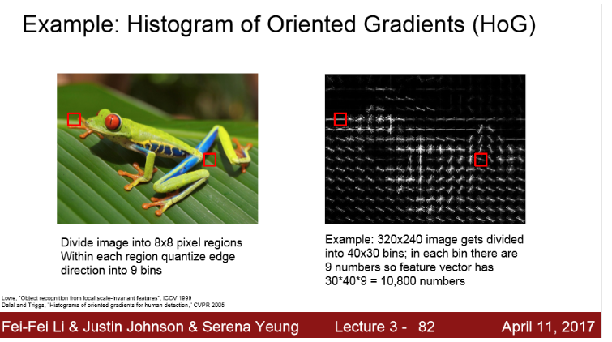

# [Loss function]

## 0. Loss function

- 일단 어떤 X와 Y가 존재하고, 내가 만들 **파라미터 W가 얼마나 좋은지를** 정량화하는

  손실 함수를 만드는 것이다.

  ==> **Loss를 최소화하는 어떤 W를 찾는 것**이다.

## 1. Multi class SVM의 loss

> - s : 분류기의 출력으로 나온 예측된 스코어
> - 만약 1이 고양이고, 2가 개면 ==> s_1은 고양이 스코어, s_2는 개 스코어
> - Y_i는 이미지의 실제 정답 카테고리 ( 정수 값 )
> - S_Y_i 는 training set의 i번째 이미지의 정답 클래스의 스코어

> - cat은 정답 클래스니까,  s_y_i = 3.2

결과는  ==> 

## 2. Multi class SVM의 loss - Regularization

==> training set에만 맞춰진 파란색 그래프라면 새로운 초록색 데이터가 들어왔을 때 

​       맞지 않음

==> 이를 해결하는 방법을 통틀어 **Regularization**이라 한다.

==> 다음과 같이 손실함수에 항을 하나 추가한다.

> - Data loss : 분류기가  training data에 학습
> - Regularization : 모델이 좀 더 단순한 W를 선택하도록 도와줌

> - L2 Regularization : 가중치 행렬 w의 Euclidean Norm에 패널티를 주는 것
> - L1 Regularization : w에 패널티를 부과하는 것
> - Elastic net Regularization : L1과L2 혼합

==> 이와 같이 Regularization은 모델이 training set에 완벽히 fit하지 못하도록 모델의 복잡도에 패널티를 부여하는 방법이다.

==============================================================================

> - L2 Regularization에서는  w1보다 w2가 더 좋다.
>
>   이유) Linear classification에서 w의 의미 : "얼마나 x가 ouput class와 닮았는지"
>
>   ==> 즉, L2 Regularization에서는 x의 모든 요소가 영향을 줬으면 하는 것이니까
>
>   ​        변동이 심한 x가 있어서 특정 요소에만 의존하기 보다 모든 x의 요소가 골고루 영향을
>
>   ​        미치길 원한다.
>
> - L1 Regularization에서는   w2보다 w1가 더 좋다.

============================   Multi class SVM의 loss   ============================

## 3. Softmax Classifier / multinomial logistic regression

> Multi class SVM의 loss에서는 스코어에 대한 해석은 고려 X
>
> ==> 하지만, Multinomial Logistic regression의 손실 함수는 스코어 자체에 추가적인 의미를 부여한다. 그리고 **softmax함수를 이용해서 클래스 별 확률 분포를 계산**한다.

- 스코어를 전부 이용하는데 스코어들에 지수를 취해서 **양수**로 만들고

- 그 지수들의 합으로 다시 **정규화** 시킴

- 그래서 softmax함수를 거치면 **확률 분포**를 얻을 수 있다. ( 해당 클래스의 확률 )

  

- log는 단조증가함수이고, 정답 클래스인 log P가 높으면 좋은거

  ==> 손실 함수는 최소화시키는 게 목적이니까 log에 - 붙인다.

- 즉, SVM의 lose fucntion = **- log(P(정답 클래스))**

- 스코어가 있으면, softmax를 거치고 나온 확률 값에 -log를 추가하면 된다.

1) 숫자들 모두 **양수로** 지수화

2) 합이 1이 되도록 **정규화**

3) 정답 스코어에만 -log 

Q1)  softmax loss의 최댓값과 최솟값은?

=> 최댓값 : 무한대 ( -log(0) = 무한대 )

=> 최솟값 : 0 ( 완벽히 분류했다면 확률=1이니까 -log(1) = 0)

 

Q2) 만약 S가 모두 0근처에 모여있는 수라면 loss는 어떻게 될까?

=> -log(1/C) = log(C)

( softmax를 사용할 때 첫 번째 interation에서 해볼만한 아주 좋은 디버깅 전략이다. 

  log(C)가 아니면 잘못된 것이다.)

## 4. 두 loss function비교 ( SVM vs Softmax )

두 loss function의 차이점은 **스코어를 해석하는 방식이 다르다**는 것이다.

- **SVM** : 정답 스코어와 정답이 아닌 스코어 간의 margins을 체크
- **Softmax (crossentropy)**  : 확률을 구해서 -log(정답클래스) 

car 스코어가 다른 클래스보다 훨씬 높음 => 조금 변경해도 SVM Loss가 변하지 않음

( SVM Loss는 오직 정답과 그 외 클래스의 마진이 얼나마 되는지에만 관심이 있으니까)

## 5. 정리

1) 입력 x로부터 스코어를 얻기 위해 Linear classifier를 사용

2) softmax, svm loss와 같은  loss function로 예측 값과 정답 값 차이 측정

3) 단순화를 위해  loss function에 regularization term 추가

==> 이것을 모두 합쳐서, 최종  loss function이 최소가 되게 하는 가중치 행렬이자 파라미터인 행렬W를 구하게 되는 것이다.

==> 어떻게 loss를 줄이는 W를 찾을 수 있을까? ==> Optimization

# [Optimization]

## 1. Gradient Descent

  1) 우선 W를 임의의 값으로 초기화

  2) 그리고 loss와 gradient를 계산한 뒤에 가중치를 gradient의 반대 방향으로 업데이트한다.

​      (gradient가 함수에서 양의 방향이니까 -gradient로)

## 2. Stochastic Gradient Descent (SGD)

전체 loss는 전체 training set loss의 평균으로 사용

만약, N이 엄청 크다면, loss를 계산하는 거 너무 오래 걸림

==> 전체 데이터의 gradient와 loss를 계산하지 않고 **minibatch**라는 작은 트레이닝 샘플 집합으로 나눠서 학습한다. 이것이 **Stochastic Gradient Descent**이다.

- minibatch는 보통 2의 승수(32, 64, 128)를 쓴다.
- 임의의 minibatch를 만들어내고, minibatch에서 loss와 gradient를 계산하고, W를 업데이트한다.

# [이미지의 특징]

## 1. 컬러 히스토그램

- 이미지에서 Hue 값만 뽑아서 모든 픽셀을 각 양동이에 넣는 것

- 해당하는 색의 양동이에 넣고 각 양동이에 들어있는 픽셀의 개수를 세는 것

  ==> 이미지가 전체적으로 어떤 색인지 알 수 있다.

## 2.  Histogram of Oriented Gradients (HoG)

- NN이 뜨기 전 인기있었던 특징 벡터

- local orientation edges를 측정

- 이미지를 8x8 픽셀로 나누고 8x8 픽셀 지역 내에서 가장 지배적인 edge의 방향을 계산해서 양수화시킨다. 그리고 다양한 edge orientations에 대한 히스토그램을 계산한다. 

- 그러면 전체 특징 벡터는 각각의 모든 8x8 지역들이 가진 edge orientation에 대한 히스토그램이 된다. 

  ==> 이미지 내에 전반적으로 어떤 종류의 edge정보가 있는지를 나타낸다.

## 3.  Bag of Words

1) 이미지들을 임의대로 조각낸다.

2) 그 조각들을 K-means와 같은 알고리즘으로 군집화한다.

3) 시각 단어(visual words)는 빨간색, 파랑색, 노랑색과 같은 다양한 색을 포착한다. 

4) 이렇게 visual words 집합인 Codebook을 만들면 어떤 이미지가 있으면, 이 이미지에서의 visual words들의 발생 빈도를 통해서 이미지를 인코딩 할 수 있다.

# [Image classification의 pipeline]

- 특징이 한번 추출되면 feature extractor는 classifier를 학습하는 동안 변하지 않는다.
- 트레이닝 중에는 오직 Linear classifier만 학습이 된다.