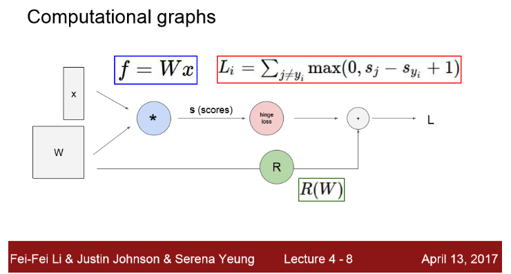

## 1. Computational graphs

그래프의 각 노드는 연산 단계를 나타낸다. 

예를 들어 다음 그림은 input이 x, W의 선형 classifier이다. 

- 곱셈 노드는 행렬 곱셈을 나타낸다.

- 파라미터 W와 데이터 x의 곱셈은 score vector를 출력한다.

- hinge loss라는 다른 계산 노드

- 데이터 항 Li를 계산할 때 쓰는 regularization 노드

-  loss 즉, L = regularization 항과 데이터 항의 합

  

  

==> Computational graphs를 사용해서 함수를 표현하게 됨으로써 **backpropagation** 기술을 사용할 수 있게 되었다.

- **backpropagation**은 gradient를 얻기위해 computational graph 내부의 모든 변수에 대해 chain rule을 재귀적으로 사용한다.

- 이 chain rule은 복잡한 함수를 이용하여 작업할 때 유용하게 쓸 수 있다. 

  다음과 같이 CNN구조는 가장 위층에 입력 이미지가 들어가고 아래에 loss가 있어서 입력 이미지는 loss function으로 가기까지 많은 layer를 거쳐 변형을 겪게 된다.

  

  

# [Backpropagation]

## 1. backpropagation의 기본 개념

- 우리가 찾기 원하는 것 : x,y,z 각각에 대한 f의 gradient 
- chain rule에 의해 뒤에서부터 계산해서 출력의 f에 대한 gradient를 계산하는 것이 목표

## 2. backpropagation의 전체 흐름(일반화)

- 각 노드는 우리가 계산한 local gradient(1)를 가지고 있고

- 값들은 상위 노드 방향으로 계속 전달되고

- 우리는 이것(2)을 받아 local gradient(1)와 곱하면 된다. 

  (계산된 gradient(2)를 local gradient(1)와 곱해서 노드의 입력에 대한 gradient를 구한다.)

  ==> 노드와 연결된 노드 이외의 다른 값들은 신경쓰지 않아도 된다.

*** local gradient 구하는 과정 추가 ***

[sigmoid function]

- ( (1-sigmoid(x)) * sigmoid(x) ) 로 계산한 값(0.2)과 

  sigmoid gate로 바꾸기 이전에 계산한 값(0.2)은 같은 값이다. 

## 3. 일반적인 Patterns

- 덧셈 게이트 : gradient를 나눠줌(같은 값으로)
- max 게이트 : 하나는 전체 값이, 다른 하나에는 0 값으로

## 4. Vectorized operations

>  변수에 대한 gradient를 항상 체크 ==> 변수와 항상 같은 모양을 가지고 있는지  

 

## 5. 코드로 구현

- forward pass : 노드의 출력을 계산하는 함수 구현
- backward pass : chain rule을 이용해 gradient 계산

특정 게이트(곱셈)에 대한 구현을 살펴보면 다음과 같다.

- forward pass : x,y 를 입력받고 z 리턴

  ==> 값을 꼭 저장해야 한다. ( forward pass가 끝나고 backward pass에서 더 많이 사용하니까)

- backward pass : 입력으로 upstream gradient인 dz를 받고, 출력으로 입력인 x와 y의 gradient를 전달

  ==> 출력 : dx, dy

  

  

# [정리]

- 모든 파라미터에 대해 gradient를 구하는 것은 어려움 ==> 그래서 gradient를 계산하기 위해서

  backpropagation을 사용한다.

- backpropagation은 우리가 가지고 있는 computational graph에서 chain rule을 재귀적으로 적용한 것이다. (입력이나 파라미터 등의 중간 변수를 구하기 위해)

- forward pass에서는 연산 결과를 계산하고 결과를 저장한다.

- 그리고 그 값은  gradient를 계산할 때 backward pass에서 chain rule할 때 사용하기 위한 것이고,

- upstream gradient와 저장한 값들을 곱해 각 노드의 input에 대한 gradient를 구한다.

- 그리고 이것들을 연결된 이전 노드로 통과시킨다.

# [Neural Networks]

Neural Networks(신경망) : 비선형의 복잡한 함수를 만들기 위해서 간단한 함수들을 계층적으로 여러개 쌓아올린 함수들의 집합(class)이다. 

- 선형 레이어를 쌓고, 그 사이에 비선형 레이어를 추가하여 Neural Network를 만들었다.

