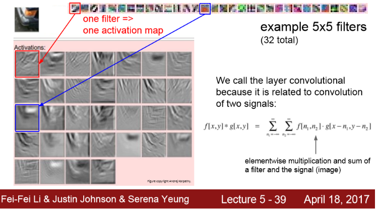
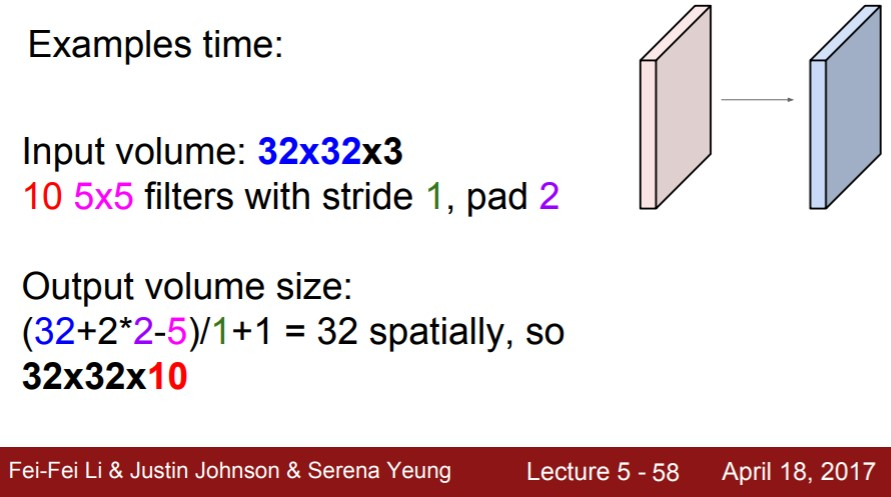

## 1. Fully Connected Layer

  1) 32x32x3 이미지가 input되고, 3072 x 1 사이즈로 길게 펴서 3072차원의 벡터로 만든다.

  2) 가중치 W (10 x 3072 행렬) 와 곱한다.

  3) activation : 10개의 행으로 되어있는데 3072 차원의 입력과 내적을 한 결과  

​		==> 한 숫자를 얻게 됨(Neuron의 한 값)

​		==> 10개의 출력

## 2. Convolution Layer 

> 기존의 FC Layer가 입력 이미지를 길게 쭉 폈다면
>
> Convolution Layer는 기존의 이미지 구조를 그대로 유지한다.

> - W를 Transpose하는 이유는 그냥 내적할 때 크기 맞추려고 (1 x N 행벡터로 만들기 위해서)
>
>   ==> 5 x 5 x 3 크기를 - > 1 x 75로 W를 길게 폈다.

------

> - Convolution은 이미지의 좌상단부터 시작해서 필터의 중앙 값들을 모은다.
> - 필터의 모든 요소를 가지고 내적을 하면 하나의 값을 얻는다.
> - Conv 연산을 수행하는 값들은 다시 Output activation map의 해당한는 위치에 저장한다.

------

> - 필터마다 다른 특징을 추출하기 위해서 Convolution Layer에서는 여러개의 필터를 사용한다.
>
>   ==> 5x5 필터가 6개 있으면 총 6개의 activation map을 얻음

------

이 CNN을 어떻게 활용할지에 대한 내용은 다음과 같다.

- 아래 그림처럼 Conv Layer들의 연속된 형태이다.

- 그리고 각각을 쌓아 올리면 간단한 Linear Layer로 된 Neural Network가 된다.

- 그 사이 사이에 activation function을 넣는다.

- 각 Layer의 출력은 다음 Layer의 입력이 된다.

- 각 Layer는 여러 개의 필터를 가지고 있고 각 필터마다 각각의 출력 map을 만든다.

  => 그러므로 여러 개의 Layer들을 쌓고나면 결국 각 필터들이 계층적으로 학습을 한다.

  

  

------

- 앞쪽에 있는 필터들은 low-level feature를 학습한다. (Edge와 같은 것들)
- Mid-level feature은 좀 더 복잡한 특징을 가진다. ( 코너 or blobs)
- high-level feature은 좀 더 객체와 닮은 것들이 출력된다.'

===> Layer의 계층에 따라 단순/복잡한 특징들이 존재한다.

지금까지는 Conv Layer를 계층적으로 쌓아서 단순한 특징들을 뽑고 그것을 조합해서 더 복잡한 특징으로 활용했다. 

------

[Activation map의 예제]

- 각 필터가 만든 출력값으로  위에 5 x 5 필터들을 시각화 한 것을 볼 수 있으며, 실제 ConvNet을 학습시킨 결과이다.
- 그리고 이미지와 필터간 Conv의 activation 결과를 볼 수 있다.
-  각 activation은 이미지가 필터를 통과한 결과가 되며, 이미지 중 어느 위치에서 이 필터가 크게 반응하는지를 보여준다.

------

- 입력 이미지는 여러 레이어를 통과한다.
- Conv - ReLU - Conv - ReLU - pooling(activation maps의 사이즈를 줄이는 역할) layer - FC layer(최종 스코어를 계산하기 위해 사용)

## 3. Spatial dimension

- stride = 1일때

- stride = 2일때

- stride = 3일때

- 입력 차원 : N

- 필터 사이즈  : F

- stride 몇이다라고 주어지면 다음과 같이 식을 통해서 출력의 크기를 구할 수 있다.

  ==> 이를 이용해서 어떤 **필터의 크기**를 사용해야 하는지, 어떤 **stride**를 사용해야 하는지, 그리고 출력의 크기를 알 수 있다.

## 4. zero pad

- 출력의 사이즈를 의도대로 만들어 주기 위한 것

- 이미지의 가장자리에 0을 채워넣는 것

- 목적 : **입력 사이즈와 출력 사이즈를 같도록** 하기 위한 것

  

예시 문제를 풀어보면 다음과 같다.

Q1) 출력 사이즈는 몇일까?

Q2) 레이어의 파라미터는 총 몇 개일까?

- 필터가 입력의 Depth만큼도 통과한다.
- 각각의 5x5x3 가중치에는 하나늬 bias가 있다.
- 필터당 76개의 파라미터가 있고, 이 필터가 총 10개 있으니까 전체 760개의 파라미터가 있는 것

[Conv Layer 요약 정리]

- 어떤 n차원 입력이 있고, 

- 필터 개수, 필터 크기, stride 크기, zero-padding 크기를 정해준다.

-  출력 사이즈, 전체 파라미터 수 확인

- 일반적인 사이즈 

  - 필터 사이즈 : 3 x 3, 5 x 5
  - stride : 1 or 2 
  - 필터 개수 : 2의 제곱수 ( 32, 64, 128, 512)

  

------

지금까지는 CNN에 들어가는 Layer 중에 CONV Layer를 살펴봤다.

이제부터는 CNN에 들어가는 다른 Layer인 Pooling Layer를 본다.

------

## 5. Pooling Layer

- Pooling Layer는  Representation들을 더 작고 관리하기 쉽게 해줌 
- "Depth"에는 영향을 주지 않는다.
- Pooling Layer에서는 Padding 안 한다. (목적이 downsampling이니까)

- Conv Layer에서 썼던 수식 그대로 이용

   (W - Filter Size) / Stride + 1

## 6.  FC Layer

이전에 살펴본 FC와 같다.

-  마지막 Conv Layer의 출력은 3차원 volumn으로 이루어진다. 
- 이 값들을 전부 펴서(stretch) 1차원 벡터로 만든다.
- 그리고 이를 가지고 FC Layer의 입력으로 사용한다.
- 이렇게 되면 Conv Net의 모든 출력을 서로 연결하게 되는 것이다.
- 마지막 Layer부터는 공간적 구조(spatial structure)를 신경쓰지 않는다.
- 전부 다 하나로 통합시키고 Score가 출력으로 나오게 된다. 

[정리]

- Pooling 이나 FC Layer를 점점 없애는 추세 => 그냥 Conv Layer만 깊게 쌓는 것

- 전형적인 CNN 아키텍쳐는 Conv와 ReLU를 몇 번 반복한다. 그리고 중간에 pooling도 몇 번 들어가고, FC Layer가 이어진다.

- 그리고 Class score를 구하기 위해 softmax를 사용한다. ( 일반적으로 n = 5 )

  

