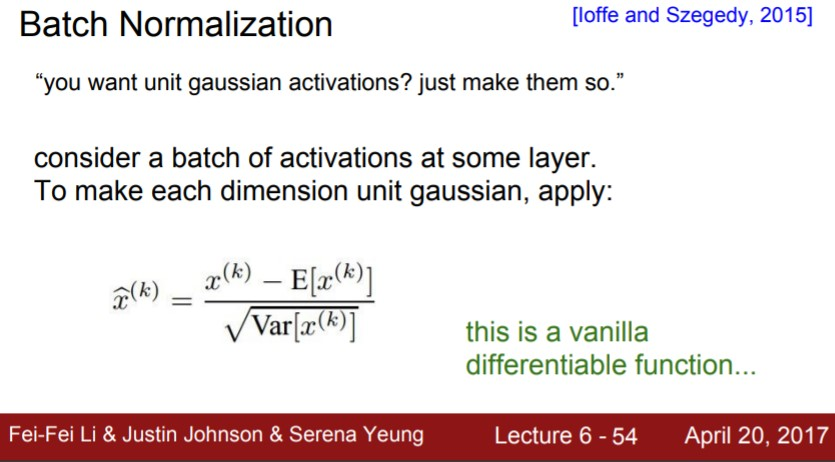

[지난 시간 배운 내용]

- CNN : "Spatial structure"를 사용하기 위해 Conv Layer를 사용하는 NN의 특수한 형태

neural network를 학습시키는 방법

- Conv 필터가 입력 이미지를 슬라이딩해서 계산한 값들이 모여 출력 Activation map을 만든다.
- Conv layer는 여러개 필터를 사용했는데, 각 필터는 서로 다른 Activation map을 생성
- Mini-batch SGD : 
  - 우선 데이터의 일부만 가지고 Forward pass를 수행하고 Loss를 계산한다. 
  - 그리고 gradient를 계산하기 위해 backprop을 계산한다.
  - 그 gradient를 이용해서 파라미터를 업데이트한다.

# Training Neural Networks

   [Overview]

1. One time setup
   - activation functions
   - preprocessing
   - weight initialization, regularization
   - gradient checking 
2. Training dynamics 
   - 학습이 잘 되고 있는지 확인하는 방법
   - 파라미터 업데이트 방법
   - 가장 적절한 하이퍼파라미터를 찾기 위해 하이퍼파라미터를 Optimization하는 방법

3. Evaluation 
   - model 앙상블

# Part 1 

   [목차]

1. Activation Functions
2. Data Preprocessing 
3. Weight Initialization 
4. Batch Normalization 
5. Babysitting the Learning Process 
6. Hyperparameter Optimization

## 1. Activation Functions

- 데이터 입력이 들어오면 가중치(w)와 곱함 ( FC, CNN)
- 그 다음 Activation Functions( 비선형 연산 )을 거침

- Sigmoid 함수
  - 입력을 받아서 그 입력을 [0,1] 사이의 값이 되도록 해준다.
  - 입력 값이 크면 Sigmoid의 출력은 1에 가까움
  - 문제점
    - 1) 큰 음수이거나 양수일때 gradient = 0
    - 2) zero-centered가 아니기 때문에 gradient 업데이트가 효율적이지 않음
    - 3) exp() 때문에 계산비용이 크다.
- tanh 함수
  - 범위 : [-1 , 1]
  - zero-centered 
  - 문제점
    - 1) 큰 음수이거나 양수일때 gradient = 0
- ReLU 함수
  - f(x) = max (0 , x)
  - 입력이 음수면 0, 양수면 입력 값 그대로 출력
  - 단순한 max연산이라서 계산이 효율적임 ( 속도가 빠름 )
  - 문제점
    - zero-centered가 아님

- Maxout Neuron
  - 앞에 활성화 함수와는 조금 다르게 생김
  - 입력을 받아드리는 특정한 기본 형식을 미리 정의하지 않음
  - ReLU와 leaky ReLU의 좀 더 일반화된 형태
  - 문제점
    - 뉴런당 파라미터의 수가 두배가 된다. 

 ==> ReLU가 가장 많이 쓰인다. 

# 2. Data Preprocessing 

가장  대표 적인 전처리 과정은 "zero-mean"으로 만들고 "normalize"하는 것이다.

  

- 실제로 이미지의 경우 전처리로 zero-centering 정도만 해준다.
- normalize는 하지 않는다. 왜냐면 이미지는 이미 각 차원 간에 스케일이 어느정도 맞춰져 있기 때문

## 3. Weight Initialization 

- 임의의 작은 값으로 초기화

- 초기 W를 표준정규분포에서 샘플링

- 좀 더 작은 값을 위해 스케일링 해준다.

  0.01을 나눠 표준편차를 1e-2 즉 0.01로 만들어 준다. 

- 이런 식으로 모든 가중치를 임의의 값으로 초기화한다.

- Xavier initialization
  - 입/출력의 분산을 맞춰준다.
  -  이 방법 추천한다.

## 4. Batch Normalization 

- gaussian 범위로 activation을 유지시키는 것에 관한 다른 아이디어
- 어떤 레이어로부터 나온 batch단위 만큼의 activations이 있다고 했을 때 , 우린 이 값들이 Unit gaussian이  되기를 원한다.
- 각 뉴런을 평균과 분산으로 Normalization해줌으로써 이런 일을 함수로 구현하는 것이다. 
- 즉, Batch 단위로 한 레이어에 입력으로 들어오는 모든 값들을 이용해서 평균과 분산을 구해서 Normalization 해주는 것이다.
- 평균과 분산을 "상수"로 가지고 있으면 언제든지 미분이 가능해서 Backprop을 할 수 있다.

다음 그림을 보면

- Batch당 N개의 학습 데이터가 있고, 각 데이터가 D차원이라 했을 때
- 각 차원 별로 (feature element 별로) 평균을 각각 구해준다.
- 한 Batch 내에 이걸 전부 계산해서 Normalize한다.

- 그리고 위 연산은 FC나 Con Layer 직후에 넣어준다.
- BN은 입력의 스케일만 살짝 조정해 주는 역할이기 때문에 FC와 Conv 어디에든 적용할 수 있다.

Batch Normalization을 요약해보면 다음과 같다.

- 입력이 있고, mini-batch에서의 평균을 계산한다.

  모든 mini-batch 마다 각각 계산해 주고, 분산도 계산한다.

- 그리고 평균과 분산으로 Normalize 한 이후에 다시 추가적인 scaling, shifting factor를 사용한다.
- BN은 gradient의 흐름을 보다 원활하게 해주며 결국 더 학습이 더 잘되게(robust) 해준다.
- BN을 쓰면 learning rates를 더 키울 수도 있고 다양한 초기화 기법들도 사용해 볼 수 있다. (그래서 사람들이 BN을 쓰면 학습이 더 쉬워진다고 함)
-  BN이 regularization의 역할도 한다.
- 각 레이어의 출력은 해당 데이터 하나 뿐만 아니라 batch 안에 존재하는 모든 데이터들에 영향을 받는다.(평균, 분산)
  - 왜냐하면 각 레이어의 입력은 해당 배치의 (표본)평균으로 Normalize 되기 때문
  - 그렇기 때문에 이 레이어의 출력은 이제 오직 하나의 샘플에 대한 deterministic한 값이 아니게 되고
  - Batch 내의 모든 데이터가 입력으로 한대 묶인다고 볼 수 있다.

## 5. Babysitting the Learning Process 

- 지금까지 네트워크 설계에 관한 내용이었고,

  이제는 학습과정을 어떻게 모니터링하고 하이퍼파라미터를 조절할 것인지에 대한 내용이다.

**Step1**

데이터 전처리 ( zero-mean )

**Step2**

아키텍쳐 선택 - 우선 하나의 Hidden Layer와 50개의 뉴런을 가진 모델을 본다.

**Step3**

네트워크를 초기화

==> 코드 부분 추가하기

## 6. Hyperparameter Optimization

>  하이퍼 파라미터를 최적화시키고 가장 좋은 것을 선택하기 위한 방법들은 다음과 같다. 

**1. cross-validation**

- Training set으로 학습시키고 Validation set으로 평가하는 방법

**2. grid search**

- 하이퍼 파라미터를 고정된 값과 간격으로 샘플링하는 것
- 실제로는 grid search보다는 이전 처럼 random search를 하는 것이 더 좋다.

  