- Fancier optimization 
- Regularization 
- Transfer Learning

## 1. Fancier optimization 

## 1-1. SGD의 문제점

- 불균형 

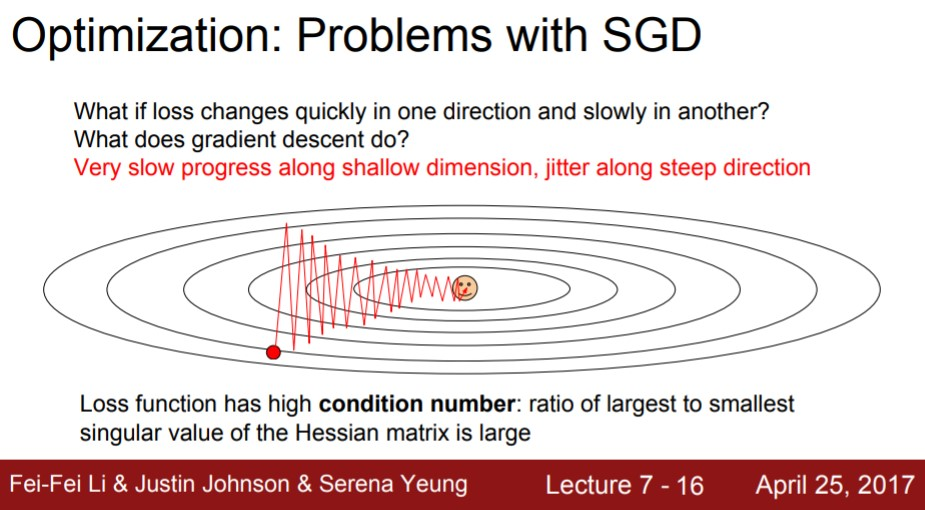

- local minima에 빠짐

  ==> gradient = 0이 되는 문제 발생

- saddle points - 한쪽 방향으로는 증가하고 있고 다른 한쪽 방향으로는 감소하고 있는 지역

  ==> gradient = 0이 되는 문제 발생

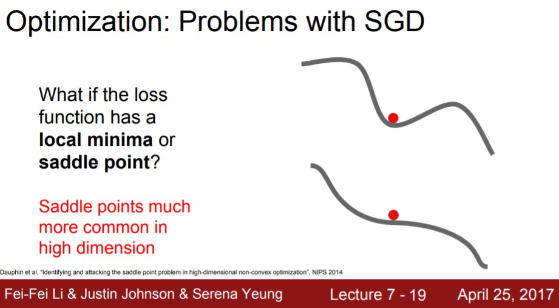

## 1-2, SGD + Momentum

- Momentum을 추가해서 velocity가 생기면 결국 noise가 평균화되버린다.

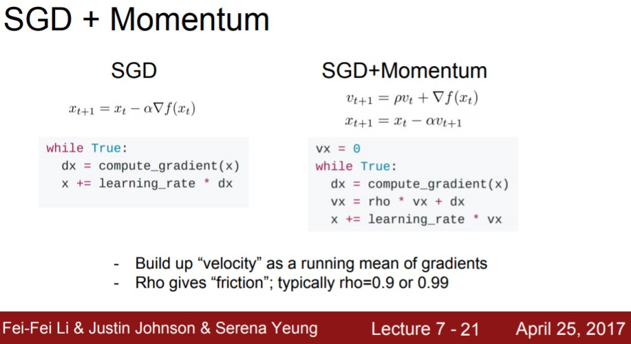

## 1-3. AdaGrad, RMSProp

- AdaGrad : 훈련 도중 계산되는 gradients를 활용하는 방법

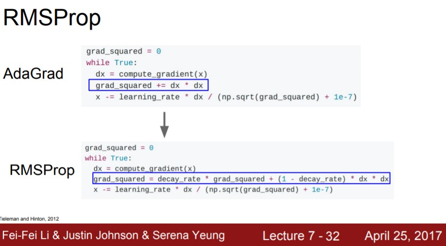

## 1-4. Adam

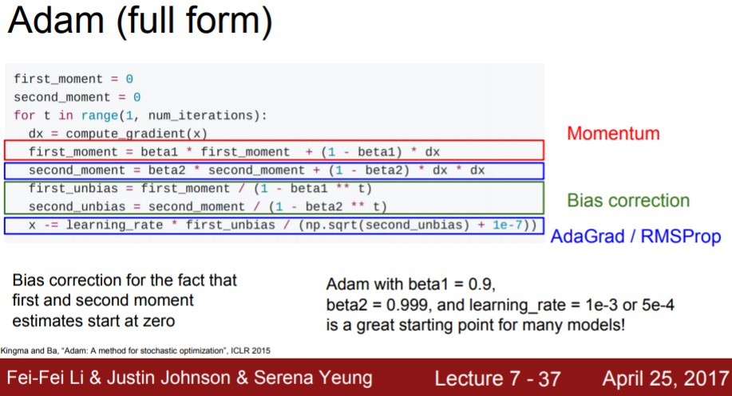

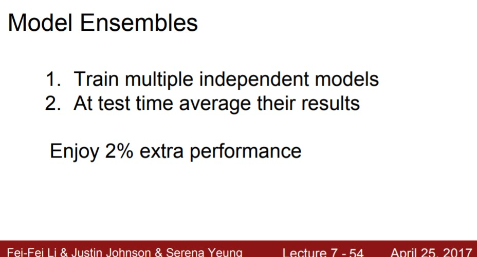

## 2. Regularization 

- 이전에 배운 regularization ( Loss에 추가 항 삽입)

  ==> L2 regularization은 Neural networks에 어울리지 않는다.

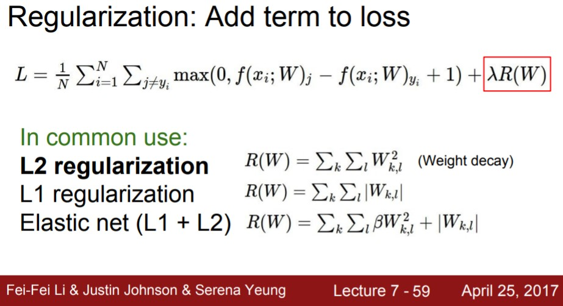

Neural networks에서 가장 많이 사용하는 regularization은 "dropout"이다.

## 2-1. Dropout

- forward pass과정에서 임의로 일부 뉴런을 0으로 만드는 것이다.
- forward pass 할 때마다 0이 되는 뉴런이 바뀜
- Dropout은 한 layer씩 진행한다.
  - 한 layer의 출력을 전부 구하고 임의로 일부를 0으로 만든다.
  - 그리고 다음 layer로 넘어간다.

다음 그림의 왼쪽은 dropout이 없고, 오른쪽은 drop out이 있는 경우이다.

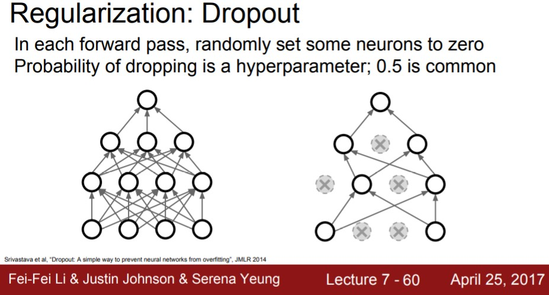

**Dropout**을 쓰는 이유는 다음과 같다.

고양이를 분류하는 어떤 네트워크가 있다고 하자.

- 어떤 뉴런은 눈에대해, 어떤 뉴런은 꼬리에대해, 또 어떤 뉴런은
  고양이의 털에 대해 학습하는 것을 상상해 볼 수 있을 것이다.

- 그리고 이 이미지가 고양이인지 아닌지를 이 정보들을
  모두 취합해서 결정을 내리는 것이다.

- Dropout을 적용하게 되면 네트워크가 어떤 일부
  features에만 의존하지 못하게 해준다.

- 대신에 모델이 "고양이다" 라고 예측할 때 다양한
  features를 골고루 이용할 수 있도록 한다.

  ==> 따라서 Dropout이 Overfitting을 어느정도 막아준다고 할 수 있다.

- 단일 모델로 앙상블 효과를 얻을 수 있다.

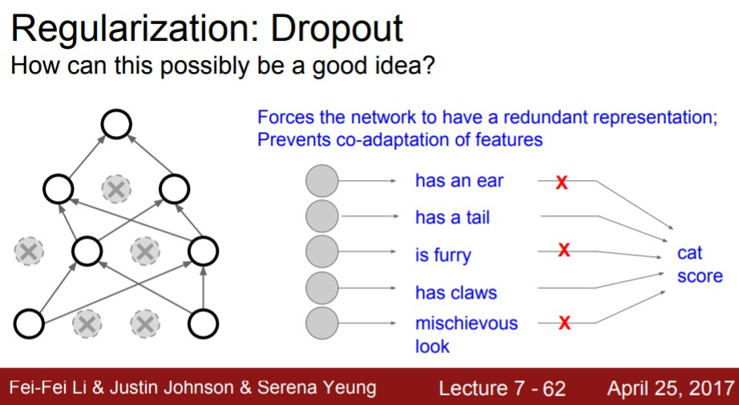

## 2-2. Batch Normalization

- Train time의 BN를 상기해보면 mini batch로 하나의 데이터가
  샘플링 될 때 매번 서로 다른 데이터들과 만나게 된다.
- Train time에서는 각 데이터에 대해서 이 데이터를 얼마나 어떻게
  정규화시킬 것인지에 대한 stochasticity이 존재했다.
- 하지만 test time에서는 정규화를 mini batch 단위가 아닌
  global 단위로 수행함으로써 stochasticity를 평균화 시킨다.
- 이런 특성 때문에 BN 은 Dropout과 유사한
  Regularization 효과를 얻을 수 있었다

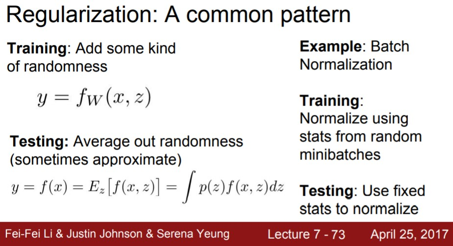

## 2-3. Data Augmentation

- 원본 이미지를 사용하는 것이 아니라, 무작위로 변환시킨 이미지로 학습시키게 되는 것

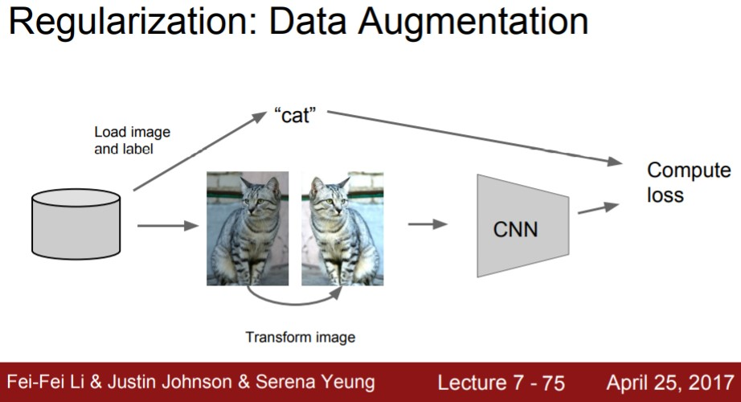

## 3. Transfer Learning

- 우선 여기 CNN모델이 있다고 해보자. 이 CNN을 가지고 우선은 ImageNet과 같은 아주 큰
  데이터셋으로 학습을 한번 시킨다.
- 이제 할 일은 Imagenet에서 학습된 features를 우리가 가진 작은 데이터셋에 적용하는 것이다.
- 1000개의 ImageNet 카테고리를 분류하는 것이 아니라 10종의 강아지를 분류하는 문제를 생각 해본다. (C=10)
- 일반적인 절차는, 우선 가장 마지막의 FC Layer는 최종
  feature와 class scores간의 연결인데 이를 초기화시킨다.
- 기존에 ImageNet을 학습시킬 때는 4,096 x 1,000 차원의 행렬이지만 우리의 새로운 문제를 풀기 위해서
  4,096 x 10(C)으로 바꿔준다.
- 그리고 방금 정의한 가중치 행렬은 초기화시키고, 그다음 나머지 이전의 모든 레이어들의 가중치는 freeze시킨다.
- 그렇게 되면  linear classifier를 학습시키는 것과 같다. 오로지 마지막 레이어만 가지고 우리 데이터를 학습시키는 것이다.
- 만일 데이터가 조금 더 있다면 전체 네트워크를 fine-tuning 할 수 있다.
- 최종 레이어들을 학습시키고 나면, 네트워크의 일부만이 아닌 네트워크 전체의 학습을 고려해 볼 수도 있을 것이다.

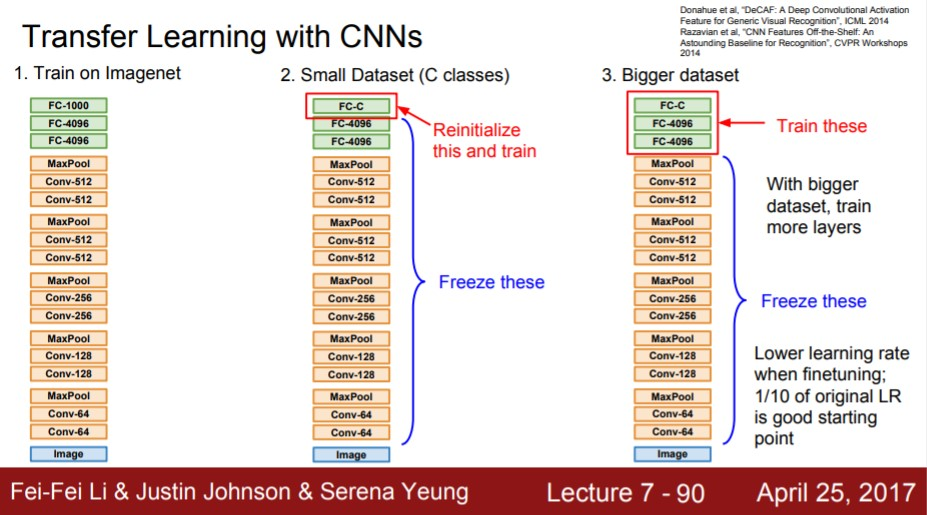

- 따라서 transfer learning을 수행 함에 있어서 이렇게 생긴
  2 x 2의 격자 시나리오를 예상해 볼 수 있을 것이다.
- 가령 현재의 데이터셋이 ImageNet와 유사하지만 소량의 경우라면, 기존 모델의 마지막 레이어만 학습시켜 볼 수 있다.
- 데이터가 그보다는 조금 많다고 생각이 되면 모델 전체를 fine tuning해 볼 수도 있을 것이다.
- 하지만 ImageNet과 다소 다르게 생긴 데이터셋을 가지고있다면 문제가 될 수 있다.
- 가령 X-rays나 CAT scans와 같은 의료영상들은 대게 ImageNet의 데이터와는 많이 달라서 기존의 전략이 잘 동작할 수도 있겠지만 어쩌면 최종 레이어만 학습시키는 전략이 쓸모없어 질 수도 있을 것이다.

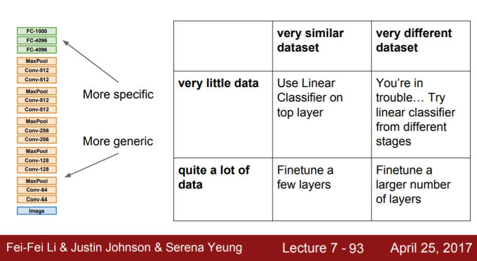

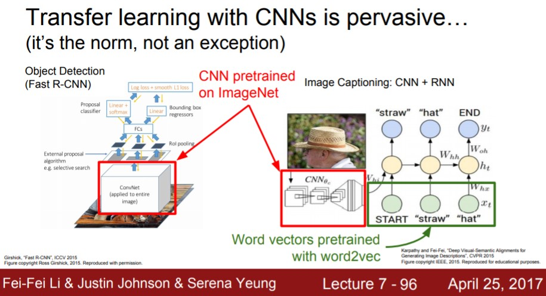

