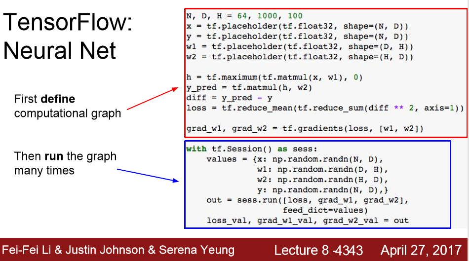
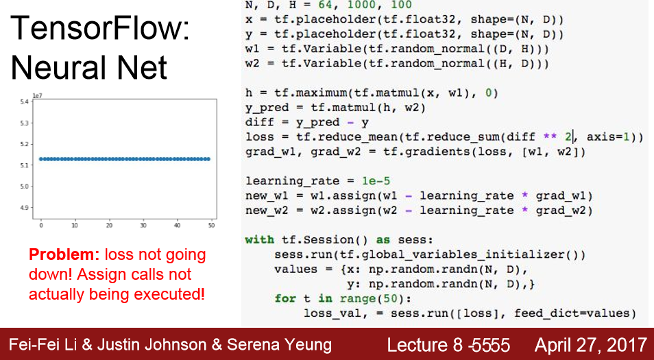
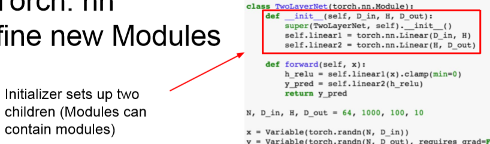

이번 시간에는 소프트웨어/하드웨어가 동작하는 방식에 대해 다룬다.

## 1. CPU vs GPU

딥러닝에서 GPU를 쓰는 이유는 다음과 같다.

-  GPU는 결과 행렬의 각 요소들을 병렬로 계산할 수 있으며 이러한 특성 때문에 GPU는 엄청 빠름

  

NVIDIA는 GPU에 고도로 최적화시킨 기본연산 라이브러리를 배포했다.

- cuBLAS 라이브러리 : 다양한 행렬곱같은 연산들
- cuDNN 라이브러리 : convolution, forward/backword pass, batch norm, rnn 등 딥러닝에 필요한 연산 제공 

## 2. Deep Learning Frameworks

## 2-1. TensorFlow

CPU vs GPU 사용 선택 가능

## 2-2. PyTorch

CPU vs GPU 사용 선택 가능

## 3. TensorFlow

- 두 개의 fc layer + ReLU를 학습시키는 네트워크

- 손실함수 : L2 Euclidean

TensorFlow는 다음과 같이 크게 두가지 단계로 나뉜다.

==>  이 부분에서 loss를 계산하고, w1과 w2의 gradient를 계산한다.

==> 여기까지의 코드에서는 실제 계산이 이루어진게 아니다! 

​        단지 Loss와 Gradient를 계산하기 위한 그래프를 만든 것 뿐이다.

==> output 변수를 보면 loss와 gradient가 Numpy array의 형태로 반환됨을 알 수 있다.

------

굳이 매번 placeholder를 써서 가중치를 넣어 줄 필요는 없다. 대신에 variables로 선언하면 된다.

변수가 그래프 내에서 업데이트가 일어나도록 다음과 같이 assign함수를 이용한다.

이 업데이트된 값들은 항상 그래프 내부에 존재하게 된다.

==> 이렇게 실행하면 다음과 같이 Loss 를 그려보면 전혀 학습이 안 된것을 볼 수 있다.

 이 경우에는 우리가 Tensorflow에게 w1과 w2를 업데이트 하라고 명시적으로 말해줘야 한다. 

다음과 같이 new_w1, new_w2를 출력으로 추가해줘서 해결할 수 있다.

하지만 new_w1, new_w2의 사이즈가 큰 tensor라면 상황은 좋지 않다.

(매 반복마다 CPU/GPU 간의 데이터 전송이 요구되니까)

다음과 같이 tf.losses.mean_squared_error와 같은 tensor operations를 사용하면 L2 loss를 직접 구현하지 않아도 된다.

앞에 내용에 따르면 입/출력도 선언해 줘야하고 이를 모두 묶어서 computational graph도 만들어주고 가중치를 초기화시켜주고 shape을 맞춰줘야 한다. 이를 간편하게 해주기 위해 Tensorflow에서 제공해주는 것 중 하나가 다음과 같은 tf.layers이다.

- 다음 예제를 보면 X와 Y만 placeholders로 선언해 준다.

- 내부적으로 w1과 b2을 variables로 만들어주고 그래프 내부에 적절한 shape으로 선언해 준다.(우리 눈에는 보이지 않음)
- 그리고 xavier initialize 객체를 사용해 어떻게 초기화시킬지 정함 (기존에는 tf.randomnormal을 사용해서 일일이 초기화 시켰음)

## 4. Keras

> TensorFlow를 backend로 해서 computational graph를 알아서 만들어 준다.

## 5. PyTorch

PyTorch는 다음과 같이 세 가지 추상화 레벨을 정의해 놓았다.

- Tensor : 명령형 배열이고, GPU에서 수행될 수 있다.
- Variable 객체 : 그래프의 노드, 그래프를 구성하고 gradient 등 계산 가능
- Module 객체 : Neural network를 구성할 수 있음

Numpy코드와 비슷한데 GPU에서 돌아갈 수 있는 것이 PyTorch라고 보면 된다.

==> PyTorch tensor를 쉽게 생각하면 Numpy + GPU 라고 보면 된다.

------

다음은 variable에 대한 내용이다.

- variables : computational graphs를 만들고 이를 통해 gradient를 자동으로 계산하는 등의 목적으로 사용
- X : variable
- x. data : tensor
- x.grad : variable인데 Loss에 대한 gradient를 담고 있다.
- 

==> gradient가 자동 으로 계산된다는 것 이외에는 Numpy와 아주 유사한다.

다음이 PyTorch로 학습을 하는 경우 가장 일반적인 패턴이다.

------

PyTorch는 다음과 같이 Pretrained Models을 제공한다.

+ Caffe 내용 추가