오늘은 최신 CNN 아키텍쳐들에 대해서 다룬다.

## 1. AlexNet

- 최초의 Large scale CNN

- conv - pool - normalization 구조가 두 번 반복된다.

- 그리고 conv layer가 조금 더 붙고(conv 3,4,5) 그 뒤에 pooling layer가 있다. ( Max POOL3 )

- 마지막에 FC-layer가 몇 개 붙는다. ( FC6, FC7, FC8)

  ==> 5개의 Conv Layer와 2개의 FC-Layer로 구성된다.

  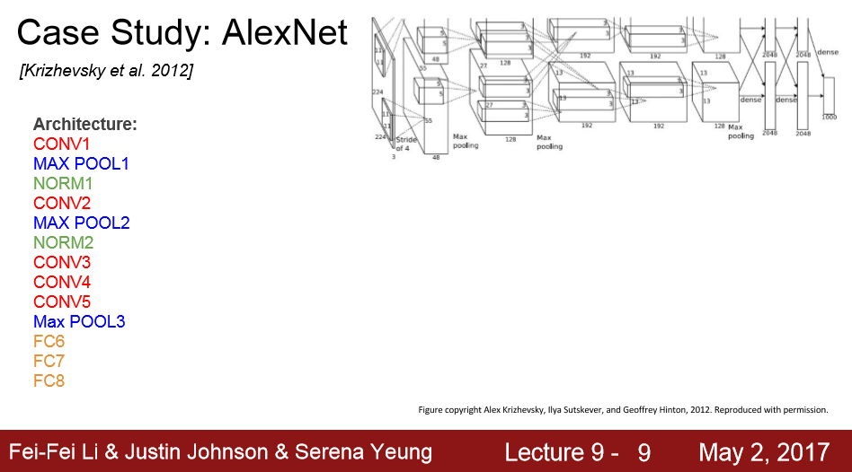

- **첫 번째 Layer** : 11x 11 필터가 stride = 4로 96개 존재한다.

  ==> output 사이즈 ( 227-11 )/4 + 1 = 55니까

  ==> 55x55x96

  ==> 파라미터 사이즈 : (11x11x3)x96 = 35K

  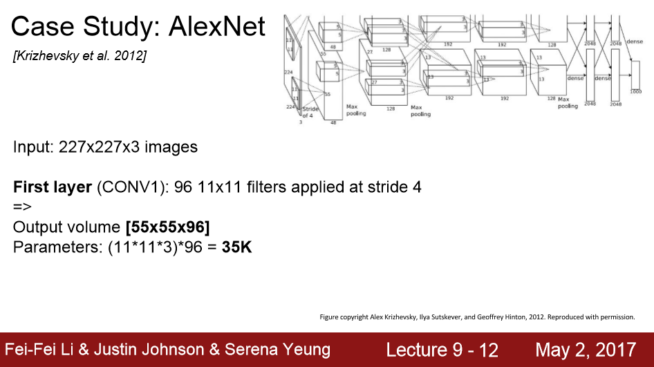

- **두 번째 Layer** : Pooling L ayer

  ==>  pooling은 가중치가 없고 그저 특정 지역에서 큰 값을 뽑아내는 역할만 하니까 학습시킬  파라미터가 없음

  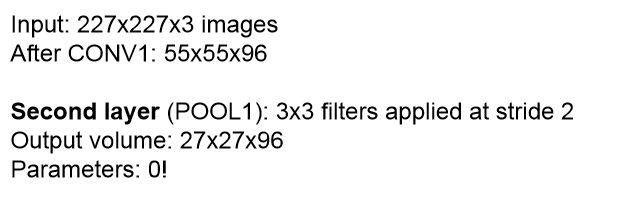

  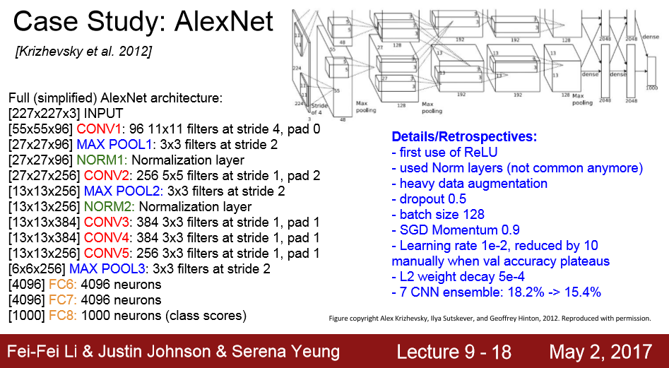

## 2. VGGNet

- 더 작은 필터 사용
  - 필터의 크기가 작으면 파라미터의 수가 더 적으니까 큰 필터에 비해 layer를 조금 더 많이 쌓을 수 있다.

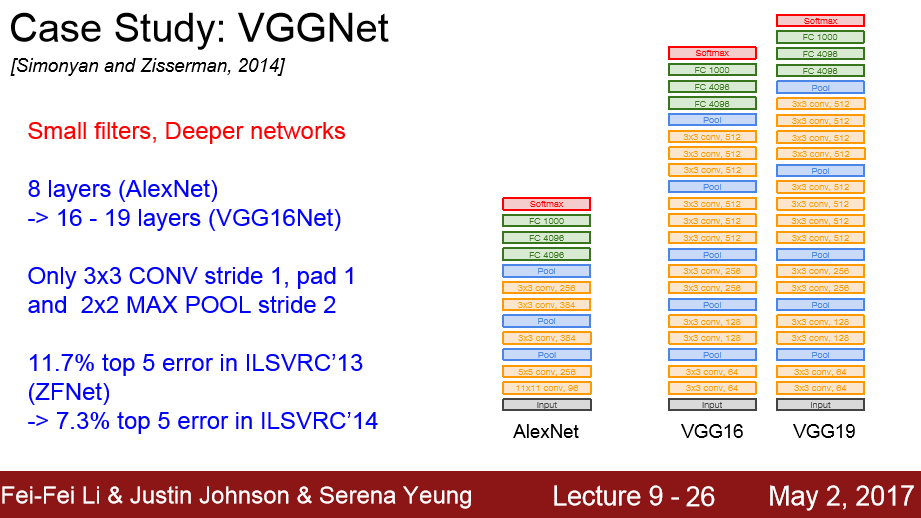

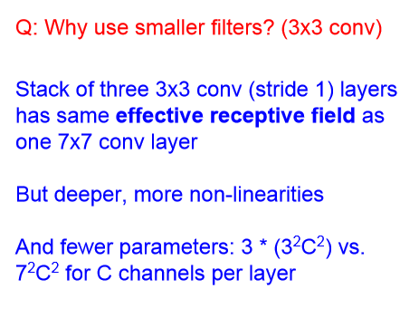

## 3. GoogLeNet

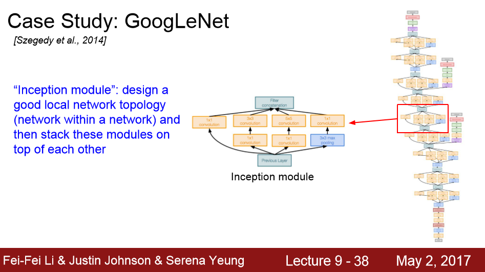

- 더 깊고, 계산에 효율적이다.

- 22개의 레이어를 가지고 있다.

- Inception module을 여러개 쌓아서 만든다.

- FC- Layer가 없다. (파라미터를 줄이기 위해서)

  

그렇다면 Inception module이란 무엇일까

==> Local Network를 Inception Module이라고 한다.

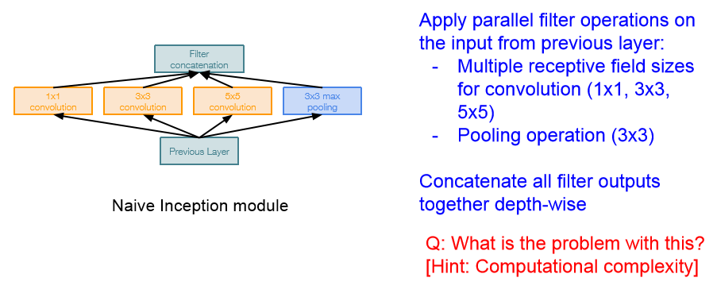

- Inception module 내부에는 동일한 입력을 받는 서로 다른 다양한 필터들이 "병렬로" 존재한다.

- 이전 레이어의 입력을 받아서 다양한 Conv연산을 수행하는 것이다.

  ==> 이 방법으로 하면 계산 비용이 발생한다.

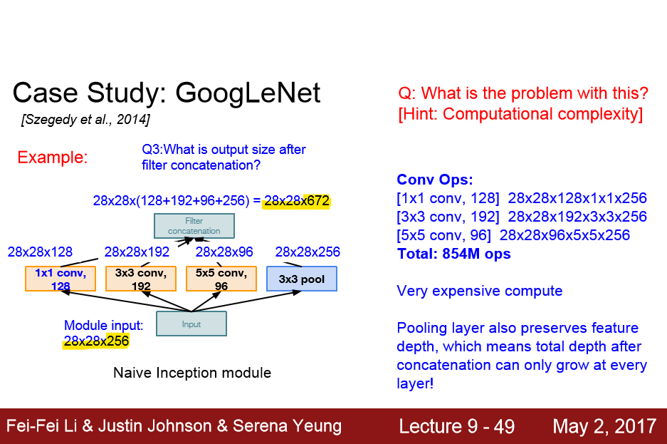

==> 레이어를 거칠 때마다 Depth가 점점 늘어간다. 이 문제를 어떻게 해결할까?

==> "bottleneck layer"이용하기 - Conv 연산을 수행하기 전에 입력을 더 낮은 차원으로 보내는 것이다.

- 주요 아이디어는 입력의 depth를 줄이는 것이다.
- 각 레이어의 계산량은 1x1 conv를 통해 줄어든다.

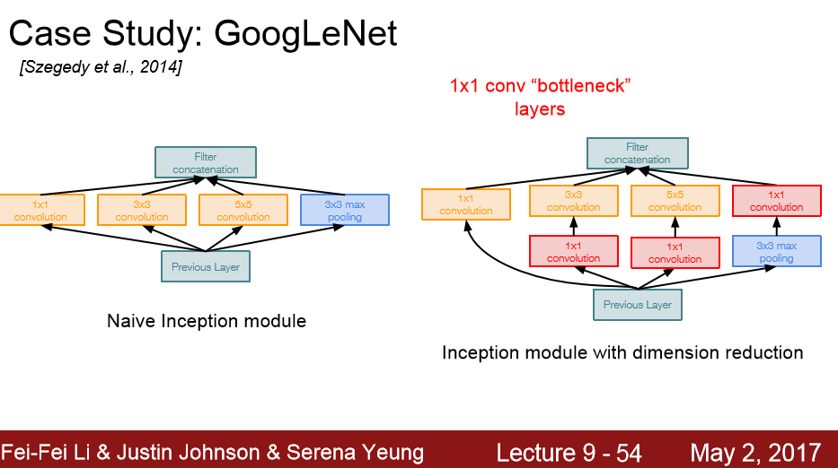

계산량을 다시 세어보면 다음과 같다.

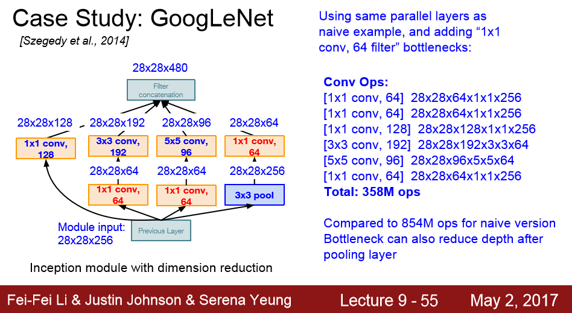

==> 계산량이 358M으로 줄어들었다.

==> 1x1 conv를 이용하면 계산량을 조절할 수 있다는 것을 알게 되었다.

[GoogLeNet의 전체 흐름]

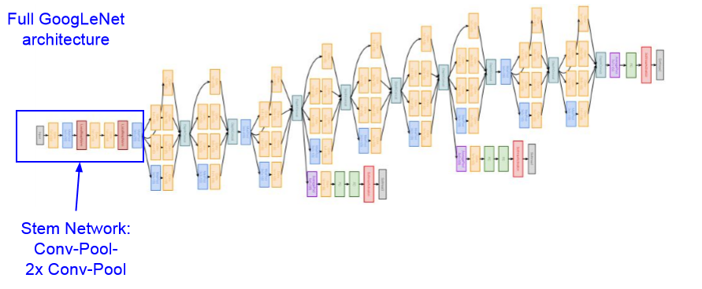

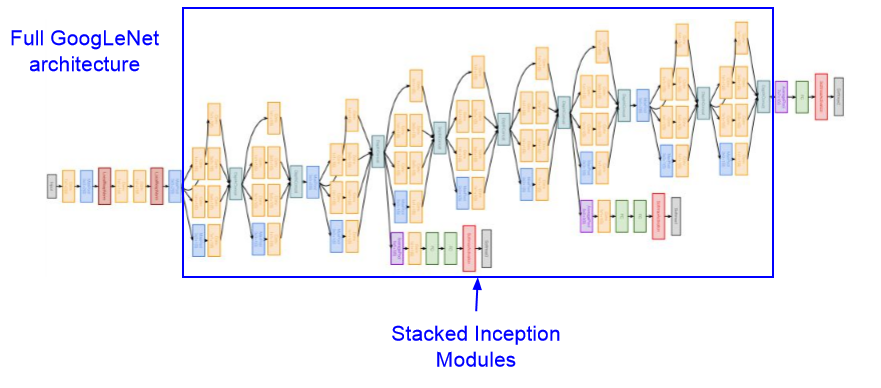

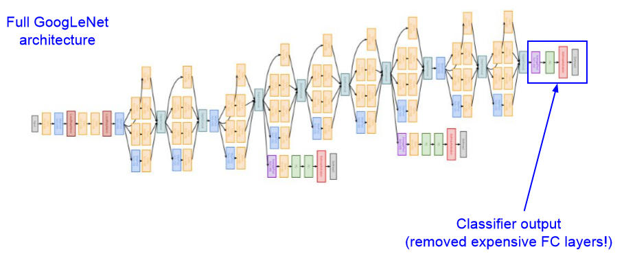

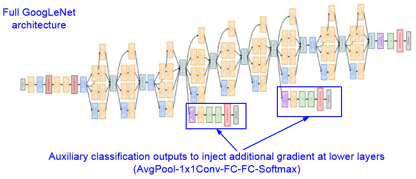

## 4. ResNet

- 가장 많이 사용함

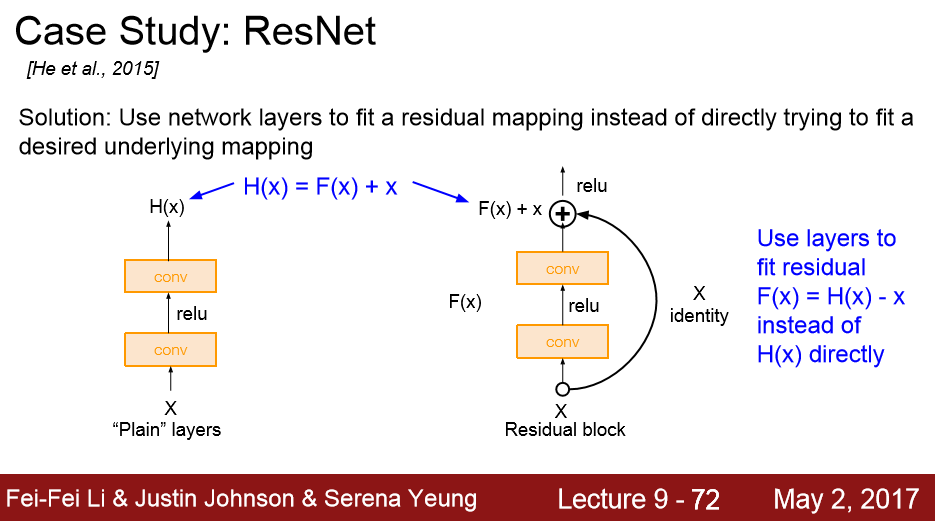